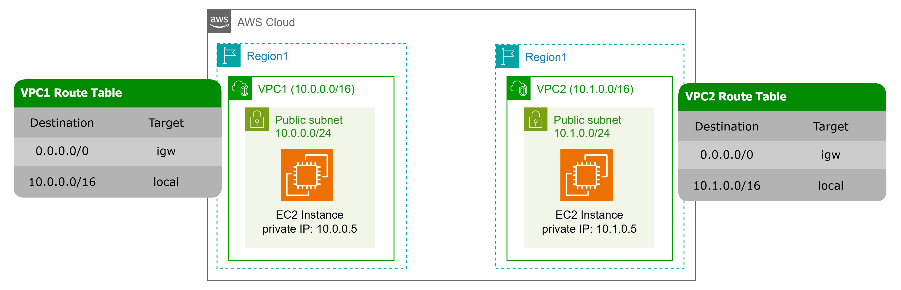

# VPC Peering 
This folder contains Terraform configurations that create two vpcs with all necessary components in two aws regions to test the VPC Peering.
It also creates two EC2 instances and security groups for testing.

## Architecture Initial State's Diagram


## Architecture Final State's Diagram


*It's possible to modify the code to do peering the same region, for that you can  edit the aws_vpc_peering_connection and remove the aws_vpc_peering_connection_accepter resource in the main.tf file.

```hcl
resource "aws_vpc_peering_connection" "peer1" {
  vpc_id      = module.vpc_region1.vpc_id
  peer_vpc_id = module.vpc_region2.vpc_id
  auto_accept = true
}
```


