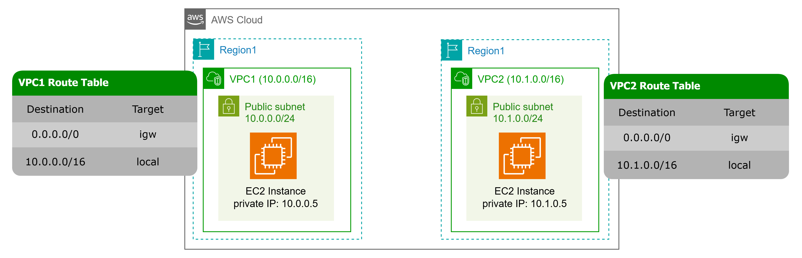

# VPC Peering 
Esta pasta contém código Terraform que cria duas VPCs com todos os componentes necessários em duas regiões da AWS para testar o VPC Peering. 
Ele também cria duas instâncias EC2 e Security Groups para testes.

## Diagrama do Estado Inicial da Arquitetura


## Diagrama do Estado Final da Arquitetura


*É possível modificar o código para realizar o peering na mesma região. Para isso, você pode editar o aws_vpc_peering_connection e remover o recurso aws_vpc_peering_connection_accepter no arquivo main.tf.

```hcl
resource "aws_vpc_peering_connection" "peer1" {
  vpc_id      = module.vpc_region1.vpc_id
  peer_vpc_id = module.vpc_region2.vpc_id
  auto_accept = true
}
```
